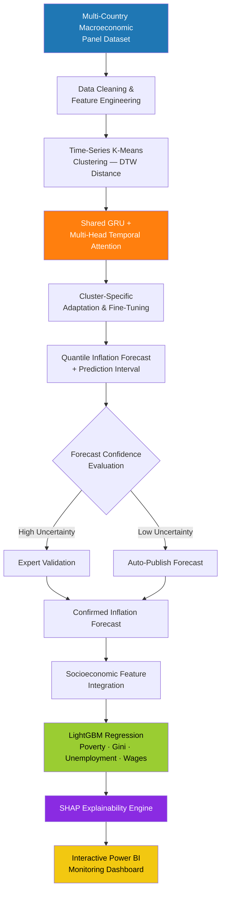

# Global-Pricewatch
A data-driven global inflation analysis and forecasting project that explores historical inflation trends across countries and uses machine learning and time-series models to predict future inflation patterns.

<div align="center">

# 🌍 Global Pricewatch

### Cross-Country Machine Learning Platform for Inflation Forecasting & Socioeconomic Impact Analysis

[](https://www.python.org/)
[](https://www.tensorflow.org/)
[](https://pytorch.org/)
[](https://powerbi.microsoft.com/)
[](#-license)

[](#)
[](#)
[](#-contributing)
[](#-contributing)
[](#)

**Forecast inflation. Explain what's driving it. Quantify who it hits hardest.**

[Overview](#-overview) • [Architecture](#-system-architecture) • [Demo](#-dashboard-preview) • [Tech Stack](#-tech-stack) • [Getting Started](#-getting-started) • [Roadmap](#-roadmap) • [FAQ](#-faq)

</div>

---

## 📌 Overview

**Global Pricewatch** is a machine learning platform that forecasts inflation across multiple economies and translates those forecasts into interpretable, income-group-aware socioeconomic impact estimates.

Instead of treating inflation forecasting as a single-country, single-model problem, Global Pricewatch clusters economies by the *shape* of their historical inflation trajectories, trains a shared deep-learning model across those clusters, and fine-tunes per country — then pushes every forecast through an explainability and impact layer before it ever reaches a dashboard.

<table>
<tr>
<td width="33%" valign="top">

### 🎯 Forecast
Multi-country GRU + attention model with calibrated uncertainty intervals, not just point estimates.

</td>
<td width="33%" valign="top">

### 🧩 Explain
Every prediction is traced back to its economic drivers via SHAP — no black boxes reaching decision-makers.

</td>
<td width="33%" valign="top">

### 💰 Quantify Impact
Translates inflation forecasts into estimated effects on poverty, unemployment, inequality, and real wages.

</td>
</tr>
</table>

### Why it's different

| | Traditional Approach | Global Pricewatch |
|---|---|---|
| **Scope** | Single-country models trained in isolation | Countries clustered and modeled jointly, then fine-tuned per market |
| **Output** | Point forecast | Quantile forecast with calibrated confidence intervals |
| **Trust** | Model output taken at face value | SHAP-based attribution + CUSUM confidence thresholding before publication |
| **Relevance** | Aggregate inflation number | Aggregate forecast **and** income-group-level impact estimates |
| **Delivery** | Static report | Interactive, drillable Power BI dashboard |

---

## ✨ Key Capabilities

- 🌐 **Cross-country forecasting** — Dynamic Time Warping (DTW) clustering groups economies with similar inflation dynamics before training
- 🧠 **Attention-based deep learning** — a shared GRU network with multi-head temporal attention, plus per-cluster fine-tuning layers
- 📊 **Uncertainty-aware output** — quantile regression produces lower-bound / forecast / upper-bound ranges, not single numbers
- 🚦 **Automated reliability gating** — CUSUM-based thresholding routes low-confidence forecasts to expert review and auto-publishes high-confidence ones
- 🧩 **Built-in explainability** — SHAP values attached to every forecast and every impact estimate
- 💸 **Socioeconomic impact modeling** — LightGBM regression layer estimates poverty rate, unemployment, Gini Index, and real wage growth from forecast inflation
- 🖥️ **Interactive dashboard** — Power BI report with country drill-downs, confidence bands, and driver breakdowns
- 🔌 **Multi-source data ingestion** — unified connectors for IMF, World Bank, OECD, and FRED APIs

---

## 🏗️ System Architecture

<details open>
<summary><b>Click to expand / collapse the pipeline diagram</b></summary>



</details>

### Pipeline stages at a glance

| Stage | What happens | Core technology |
|---|---|---|
| 1️⃣ Ingestion | Pull CPI, WPI, GDP deflator, FX, and policy-rate series | IMF · World Bank · OECD · FRED APIs |
| 2️⃣ Preprocessing | Harmonize base years, align frequencies, impute gaps, scale features | Pandas, NumPy, scikit-learn |
| 3️⃣ Clustering | Group countries by inflation-trajectory similarity | tslearn (Time-Series K-Means + DTW) |
| 4️⃣ Forecasting | Learn temporal patterns and produce quantile forecasts | GRU + Multi-Head Attention (PyTorch/TensorFlow) |
| 5️⃣ Reliability Gate | Flag low-confidence forecasts for review | CUSUM thresholding |
| 6️⃣ Impact Modeling | Estimate poverty, unemployment, Gini, real wage effects | LightGBM |
| 7️⃣ Explainability | Attribute predictions to underlying drivers | SHAP |
| 8️⃣ Delivery | Present forecasts, intervals, and impact estimates | Power BI, Plotly |

---

## 🔬 Methodology

<details>
<summary><b>Data collection & preprocessing</b></summary>
<br>

- Ingests primary CPI / WPI / GDP-deflator series alongside cross-country macroeconomic indicators and policy variables (repo rate, CRR, SLR, fiscal actions)
- Harmonizes base years and reporting frequencies across sources before modeling
- Imputes gaps from delayed or missing releases, flagging every imputed point for auditability
- Applies `StandardScaler` / `MinMaxScaler` normalization to stabilize training

</details>

<details>
<summary><b>Modeling approach</b></summary>
<br>

- Countries are grouped using **Dynamic Time Warping (DTW)**-based clustering — grouping by the *shape* of inflation trajectories rather than static indicators alone
- A **shared GRU network with multi-head temporal attention** learns common patterns across all clusters, then fine-tunes per cluster for country-level accuracy
- Forecasts are produced as **quantile ranges** (lower bound / point forecast / upper bound)
- **CUSUM-based thresholding** flags low-confidence outputs for manual review before publication
- A **LightGBM regression layer** converts inflation forecasts into estimated socioeconomic outcomes, broken out by income group
- **SHAP values** are computed at every stage for auditability

</details>

<details>
<summary><b>Validation & evaluation</b></summary>
<br>

| Metric | Formula | Purpose |
|---|---|---|
| **MAPE** | (1/n) × Σ｜(Actual − Forecast) / Actual｜ × 100 | Forecast accuracy |
| **RMSE** | √[(1/n) × Σ(Actual − Forecast)²] | Forecast accuracy |
| **Pinball Loss (Lτ)** | (Actual − Forecast)×τ if Actual ≥ Forecast, else (Forecast − Actual)×(1−τ) | Interval calibration |
| **R²** | Standard coefficient of determination | Impact-model fit quality |
| **Real Income** | Nominal Income / (1 + π) | Inflation-adjusted income estimate |

Benchmarked against persistence and seasonal-naive baselines; cross-country generalization tested by comparing cluster-trained models against single-market-only baselines.

</details>

---

## 📊 Dashboard Preview

> Interactive Power BI report — country-level forecast drill-downs, confidence intervals, driver attribution, and socioeconomic impact views.

<div align="center">

| Forecast Overview | Driver Attribution | Socioeconomic Impact |
|---|---|---|
| 📈 Inflation trend + confidence band | 🧩 SHAP-ranked feature importance | 💰 Poverty / unemployment / Gini / wages by country |

</div>

Open `dashboard/GlobalPricewatch.pbix` in Power BI Desktop to explore live.

---

## 🛠️ Tech Stack

<div align="center">

**Core Language**


**Data Processing & Classical ML**


**Deep Learning**


**Visualization & Reporting**


**External Data Sources**


**Infrastructure & Tooling**


</div>

---

## 📁 Repository Structure

```
global-pricewatch/
├── data/
│   ├── raw/                  # Ingested source data
│   └── processed/            # Cleaned, harmonized datasets
├── src/
│   ├── ingestion/            # IMF / World Bank / OECD / FRED API connectors
│   ├── preprocessing/        # Cleaning, scaling, imputation
│   ├── clustering/           # DTW-based country clustering
│   ├── forecasting/          # GRU + attention model
│   ├── impact_modeling/      # LightGBM socioeconomic regression
│   ├── explainability/       # SHAP attribution
│   └── evaluation/           # Metrics and backtesting
├── dashboard/                # Power BI (.pbix) report
├── notebooks/                # Exploratory analysis
├── tests/
├── requirements.txt
├── .env.example
└── README.md
```

---

## 🚀 Getting Started

### Prerequisites

- Python 3.11+
- API keys for IMF, World Bank, OECD, and FRED data sources
- Power BI Desktop (for viewing the dashboard)

### Installation

```bash
# 1. Clone the repository
git clone https://github.com/<your-org>/global-pricewatch.git
cd global-pricewatch

# 2. Create a virtual environment
python -m venv venv
source venv/bin/activate      # Windows: venv\Scripts\activate

# 3. Install dependencies
pip install -r requirements.txt

# 4. Configure API credentials
cp .env.example .env          # add your IMF / World Bank / OECD / FRED API keys
```

### Running the pipeline

```bash
# Step 1 — Ingest data
python src/ingestion/run_ingestion.py

# Step 2 — Preprocess & harmonize
python src/preprocessing/run_preprocessing.py

# Step 3 — Cluster countries
python src/clustering/run_clustering.py

# Step 4 — Train the forecasting model
python src/forecasting/train.py

# Step 5 — Run the socioeconomic impact layer
python src/impact_modeling/run_impact_model.py

# Step 6 — Generate SHAP explainability report
python src/explainability/generate_shap_report.py
```

Then open `dashboard/GlobalPricewatch.pbix` in Power BI Desktop and point it at the `data/processed/` output to explore results interactively.

---

## 🗺️ Roadmap

- [x] Multi-country data ingestion pipeline
- [x] DTW-based country clustering
- [x] GRU + multi-head attention forecasting model
- [x] LightGBM socioeconomic impact layer
- [x] SHAP explainability integration
- [x] Power BI dashboard
- [ ] Real-time / high-frequency nowcasting using alternative data (search trends, satellite-derived economic activity)
- [ ] Reinforcement-learning-based policy simulation for testing interventions pre-deployment
- [ ] Expanded country coverage beyond the initial comparator set
- [ ] Public API layer for programmatic access to forecasts and impact estimates
- [ ] Automated model retraining pipeline (CI/CD)

---

## ❓ FAQ

<details>
<summary><b>How is this different from a standard ARIMA/VAR inflation model?</b></summary>
<br>
Traditional statistical models like ARIMA and VAR struggle to capture nonlinear relationships and long-term temporal dependencies in macroeconomic data. Global Pricewatch uses attention-based deep learning trained jointly across clustered countries, which improves generalization while still benchmarking against classical baselines for accountability.
</details>

<details>
<summary><b>Why cluster countries before forecasting?</b></summary>
<br>
Grouping economies by the shape of their inflation trajectories (via Dynamic Time Warping) lets the model share statistical strength across similar economies, rather than training an isolated model per country with limited data.
</details>

<details>
<summary><b>How are low-confidence forecasts handled?</b></summary>
<br>
Every forecast passes through a CUSUM-based confidence check. High-confidence forecasts are auto-published; low-confidence ones are routed to expert review before being confirmed.
</details>

<details>
<summary><b>Can I add a new country or data source?</b></summary>
<br>
Yes — add a new connector under <code>src/ingestion/</code> following the existing API connector pattern, then re-run the clustering and training steps.
</details>

---

## 🤝 Contributing

Contributions, issues, and feature requests are welcome.

1. Fork the repository
2. Create a feature branch (`git checkout -b feature/your-feature`)
3. Commit your changes (`git commit -m 'Add your feature'`)
4. Push to the branch (`git push origin feature/your-feature`)
5. Open a Pull Request

Please open an issue first to discuss significant changes.

---

## 📄 License

This project is licensed under the MIT License — see the [`LICENSE`](LICENSE) file for details.

---

<div align="center">

**Global Pricewatch** — forecasting inflation, explaining its impact.

</div>
